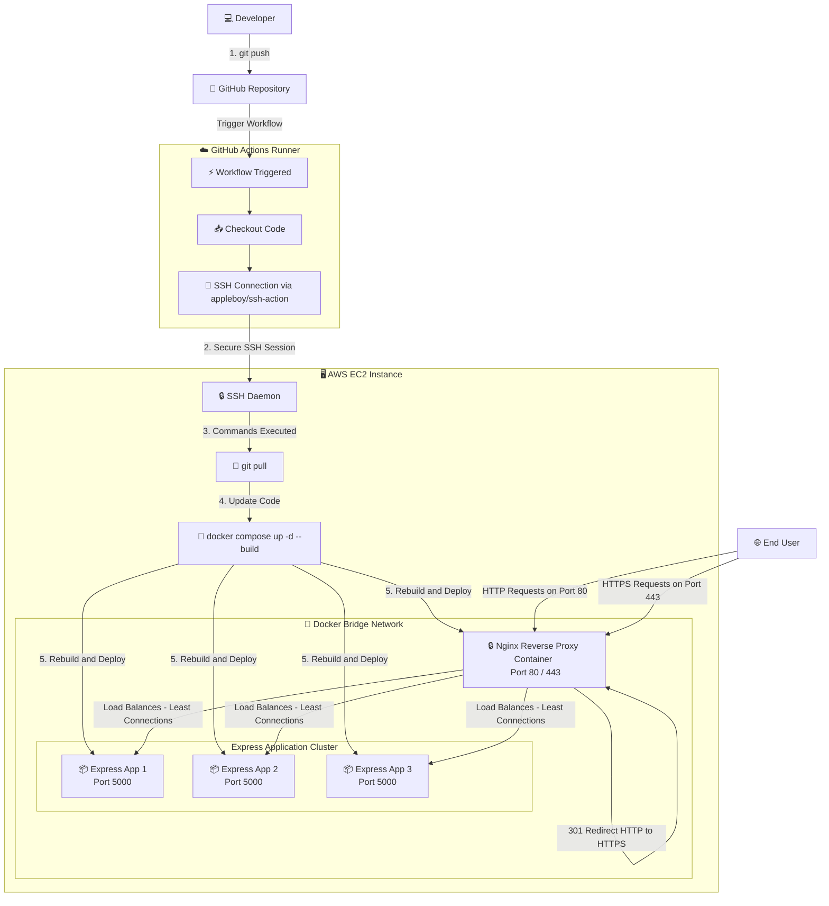

# High-Availability Express.js Cluster with Nginx Reverse Proxy, HTTPS, Rate Limiting & CI/CD

A production-grade, containerized Node.js cluster utilizing Express.js, Nginx, and GitHub Actions. This repository features a fully automated Continuous Integration and Continuous Deployment (CI/CD) pipeline deploying to an AWS EC2 instance.

---

## 🏗️ System Architecture

This diagram illustrates how client requests flow through Nginx, get load-balanced to the Express clusters, and how the CI/CD pipeline deploys code changes to the server:



---

## 🚀 Key Features

* **High Availability & Load Balancing**: Configured with 3 replicated Node.js containers (`app1`, `app2`, `app3`) load-balanced by Nginx using the `least_conn` routing algorithm.
* **Nginx Reverse Proxy**: Single point of entry. All app containers are exposed internally only (`expose: 5000`), forcing external traffic through Nginx on Port 80/443.
* **Secure HTTPS Connection**: Enabled SSL/TLS configuration (`TLSv1.2` & `TLSv1.3`).
* **HTTP to HTTPS Redirection**: Automatically redirects all insecure Port 80 HTTP requests to Port 443 HTTPS.
* **IP-Based Rate Limiting**: Built-in rate limiting (`limit_req_zone` limit of 10r/s with a burst threshold of 20) protecting the server from request flooding and returning standard `429 Too Many Requests` responses.
* **Zero-Downtime Pipeline**: Pushing to the `master` branch triggers GitHub Actions to run a remote deploy script, cleanly tearing down and rebuilding containers on the server (`docker compose down && docker compose up -d --build`).

---

## 🛠️ Tech Stack

* **Runtime Environment**: Node.js (v22-alpine)
* **Web Framework**: Express.js
* **Process Manager**: Nodemon (for local hot-reloading development)
* **Reverse Proxy / Load Balancer**: Nginx (alpine)
* **Containerization**: Docker & Docker Compose
* **CI/CD Platform**: GitHub Actions

---

## 💻 Local Setup & Installation

### Prerequisites
Make sure you have the following installed on your machine:
* [Node.js](https://nodejs.org/) (v22 or later)
* [Docker](https://www.docker.com/) & [Docker Compose](https://docs.docker.com/compose/)

### Steps
1. **Clone the repository:**
   ```bash
   git clone <your-repository-url>
   cd git_actions
   ```

2. **Generate Local Self-Signed Certificates:**
   Create the SSL certificates directory inside the `nginx` folder and generate mock certificates for testing:
   ```bash
   mkdir -p nginx/ssl
   openssl req -x509 -nodes -days 365 -newkey rsa:2048 \
     -keyout nginx/ssl/nginx-selfsigned.key \
     -out nginx/ssl/nginx-selfsigned.crt \
     -subj "/CN=localhost"
   ```

3. **Run the Application Cluster:**
   ```bash
   docker compose up -d --build --remove-orphans
   ```

4. **Verify Locally:**
   * **Insecure Redirect check:** `curl http://localhost` (Should return `301 Moved Permanently`).
   * **Secure HTTPS query:** `curl -k https://localhost` (Should return the Express JSON with dynamic `container_id` indicating which replica served the request).

---

## 🌐 Production Server Configuration (AWS EC2)

To configure this multi-container load-balanced application on your target Ubuntu EC2 instance:

1. **Install Docker and Docker Compose:**
   ```bash
   sudo apt update
   sudo apt install docker.io docker-compose-v2 -y
   ```

2. **Configure Docker Permissions** (so the `ubuntu` user can run Docker commands without `sudo`):
   ```bash
   sudo usermod -aG docker $USER
   newgrp docker
   ```

3. **Open Inbound Ports in AWS Security Group:**
   Make sure you open the following inbound ports to the public internet (`0.0.0.0/0`):
   * **Port 80 (HTTP)**
   * **Port 443 (HTTPS)**
   * **Port 22 (SSH)**

4. **Add SSL Certificates on Server:**
   Create the certificates directory on the server and place your trusted certificates (e.g., Let's Encrypt / Certbot) inside. Ensure the key file names match the volume mounts (`nginx-selfsigned.crt` and `nginx-selfsigned.key` or update `default.conf` accordingly):
   ```bash
   mkdir -p /home/ubuntu/git_actions/nginx/ssl
   # Place your certificates inside this folder
   ```

---

## 🔑 GitHub Actions Secrets Setup

For the CI/CD pipeline to work correctly, add the following secrets in your GitHub repository settings under **Settings** ➔ **Secrets and variables** ➔ **Actions**:

| Secret Key | Description | Example Value |
|---|---|---|
| `SSH_HOST` | The public IP address or DNS of your EC2 server | `65.2.30.32` |
| `SSH_KEY` | The private SSH key used to authenticate with your server | Contents of your `nginx.pem` |
