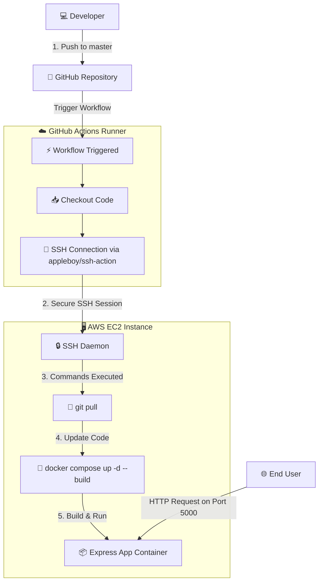
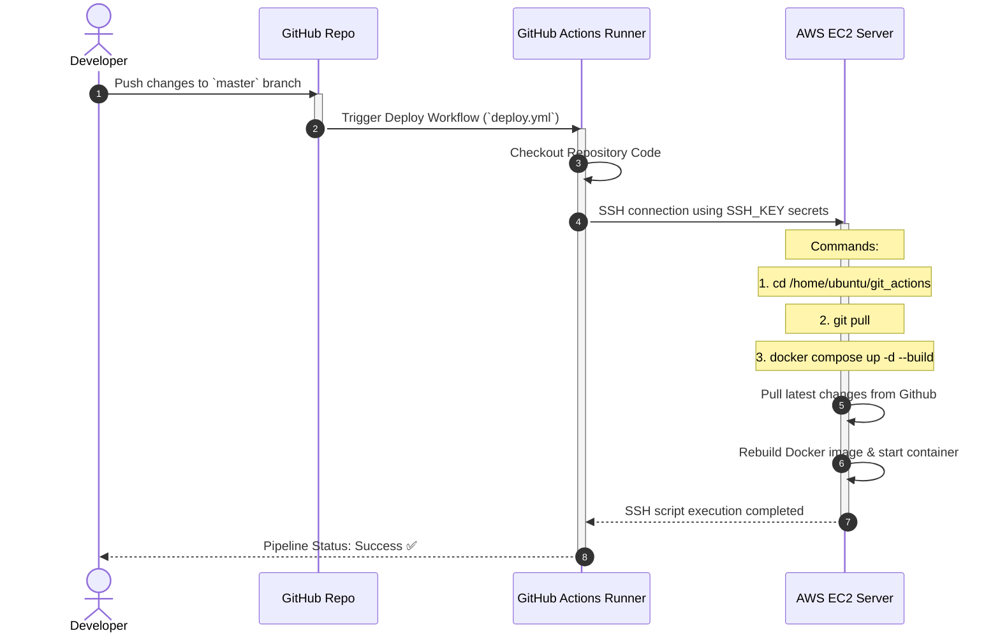

# Express.js CI/CD Pipeline with GitHub Actions & Docker

A professional, containerized Node.js web application utilizing Express.js, Docker, and GitHub Actions for a fully automated Continuous Integration and Continuous Deployment (CI/CD) pipeline to an AWS EC2 instance.

---

## 🏗️ Architecture Diagram

This diagram illustrates how the local workspace, GitHub repository, GitHub Actions runner, and target EC2 server interact during development and deployment:



---

## 🔄 CI/CD Deployment Flow

Below is the step-by-step process of the pipeline execution when a push event occurs:



---

## 🚀 Key Features

* **Continuous Deployment (CD)**: Zero-manual deployment. Any commit pushed to the `master` branch is instantly deployed to the cloud.
* **Containerized Architecture**: Packaged using Docker to ensure environment parity between local development and production.
* **Process Management**: Automatically restarts the application unless manually stopped (`restart: unless-stopped` in Docker Compose).
* **Environment Configuration**: Robust environment variable handling via `.env` files.

---

## 🛠️ Tech Stack

* **Runtime Environment**: Node.js (v22-alpine)
* **Web Framework**: Express.js
* **Process Manager**: Nodemon (for development)
* **Containerization**: Docker & Docker Compose
* **CI/CD Platform**: GitHub Actions

---

## 💻 Local Setup & Installation

### Prerequisites
Make sure you have the following installed on your machine:
* [Node.js](https://nodejs.org/) (v22 or later)
* [Docker](https://www.docker.com/) & [Docker Compose](https://docs.docker.com/compose/)

### Steps
1. **Clone the repository:**
   ```bash
   git clone <your-repository-url>
   cd git_actions
   ```

2. **Install Dependencies:**
   ```bash
   npm install
   ```

3. **Run in Development Mode:**
   ```bash
   npm run dev
   ```
   The server will start on `http://localhost:5000` with hot-reloading enabled via `nodemon`.

### Running locally with Docker
To test the production container configuration locally:
```bash
docker compose up --build
```

---

## 🌐 Production Server Configuration (AWS EC2)

To set up the application on your Ubuntu-based target server:

1. **Install Docker and Docker Compose:**
   ```bash
   sudo apt update
   sudo apt install docker.io docker-compose-v2 -y
   ```

2. **Configure Docker Permissions** (so that `ubuntu` user can run docker without `sudo`):
   ```bash
   sudo usermod -aG docker $USER
   newgrp docker
   ```

3. **Clone the repository** into `/home/ubuntu/git_actions`:
   ```bash
   git clone <your-repository-url> /home/ubuntu/git_actions
   ```

---

## 🔑 GitHub Actions Secrets Setup

For the CI/CD pipeline to work correctly, add the following secrets in your GitHub repository settings under **Settings** ➔ **Secrets and variables** ➔ **Actions**:

| Secret Key | Description | Example Value |
|---|---|---|
| `SSH_HOST` | The public IP address or DNS of your server | `ec2-13-127-245-217.ap-south-1.amazonaws.com` |
| `SSH_KEY` | The private SSH key used to authenticate with your server | Contents of your `gitaction.pem` |
